## Archive Item - TTL DynamoDB + Lambda
Some time we use DynamoDB to store time series data, such as webpage clickstream data or IoT data from sensors and connected devices. Rather than delete older, less frequently accessed items, we want to archive them instead. 

* One way to accomplish this is via “rolling tables,” that is pre-creating tables to store data for particular months/weeks/days. However, this requires custom application logic to handle creating and deleting tables, and switching of reads and writes to new tables. 
* Another approach is to run periodic jobs to delete old items, but this consumes write throughput and also requires custom application logic.

> DynamoDB TTL simplifies archiving by automatically deleting items based on the time stamp attribute of your choice. Items deleted by TTL can be identified in DynamoDB Streams, which captures a time-ordered sequence of item-level modifications on a DynamoDB table and stores them in a log for up to 24 hours.

In this we used dynamoDB TTL feature and lambda to archive expired data. 

I followed simple steps -

1. Create new table where do you want to store/archive the data? and set all attributes according to your need.

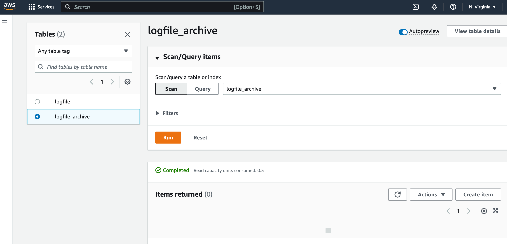

2. Go to lambda > Create lambda > Copy & Paste [this code](https://github.com/varunajmera0/AWS/tree/main/DynamoDB/ArchiveTTLLambda/archive_logfile.py) > Adjust the code according to your requirement.

3. Create role

    3.1 Go to IAM > click on policies > click on create policy > Add [this json](https://github.com/varunajmera0/AWS/tree/main/DynamoDB/ArchiveTTLLambda/mylambda_policy.json) in json tab > click next and give name to policy.

    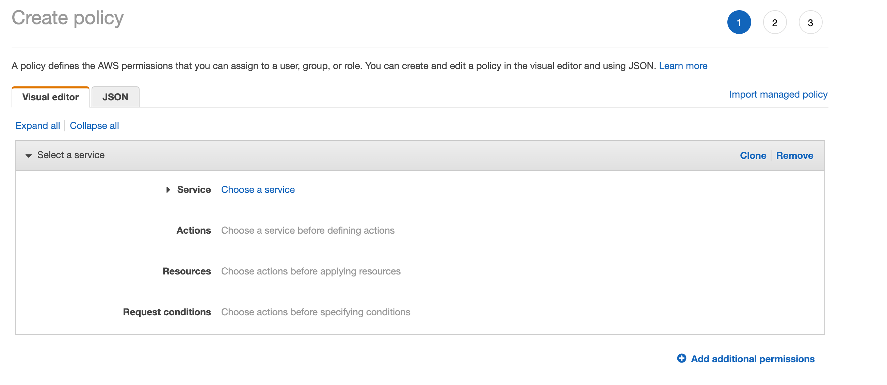

    3.2 Go to IAM > click on role > click trusted entity type > click on lambda use case (don't select anything from drop down) > then click next > search your policy and select that policy > click next > give name to role.

    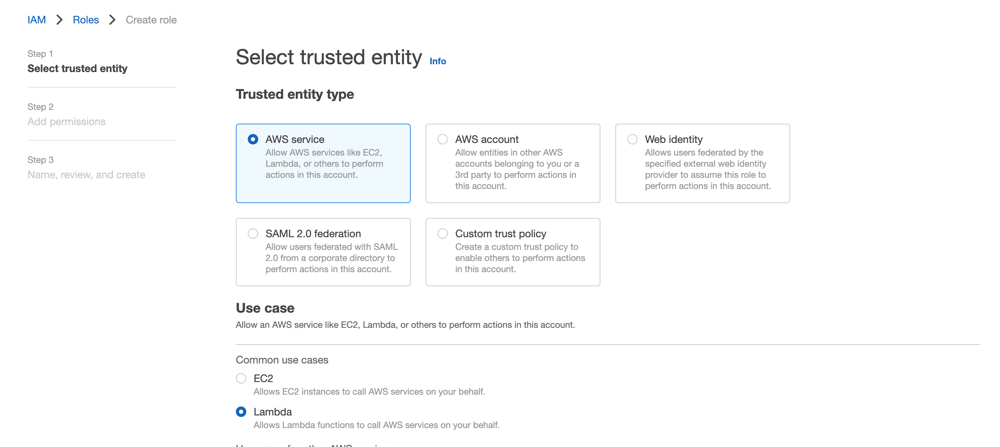

4. Now, To create trigger in lambda to capture dynamoDB TTL event.
Go to lambda configuration > Permission > click edit > Execution role > use an existing role > attach existing role from drop down. If you do not do this, you can not configure lambda with dynamodb.

5. Go to lambda configuration > triggers > add trigger > search dynamoDB >select dynamoDB table and configure others requirement according to your requirement > click add

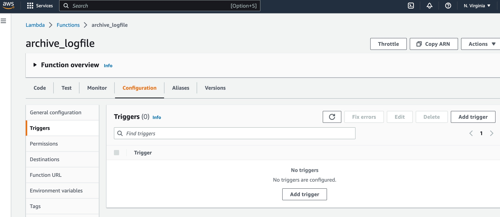

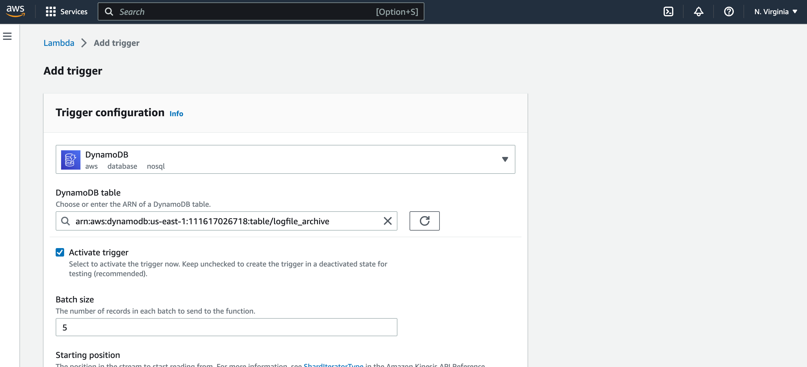

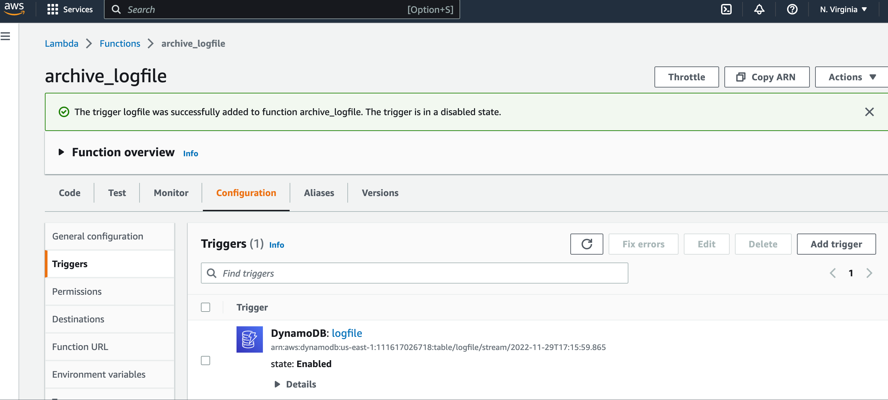

6. Go to dynamoDB table in which you want to delete the data > Additional Settings > Enable/Create TTL.
> The TTL attribute’s value must be a top-level Number data type.

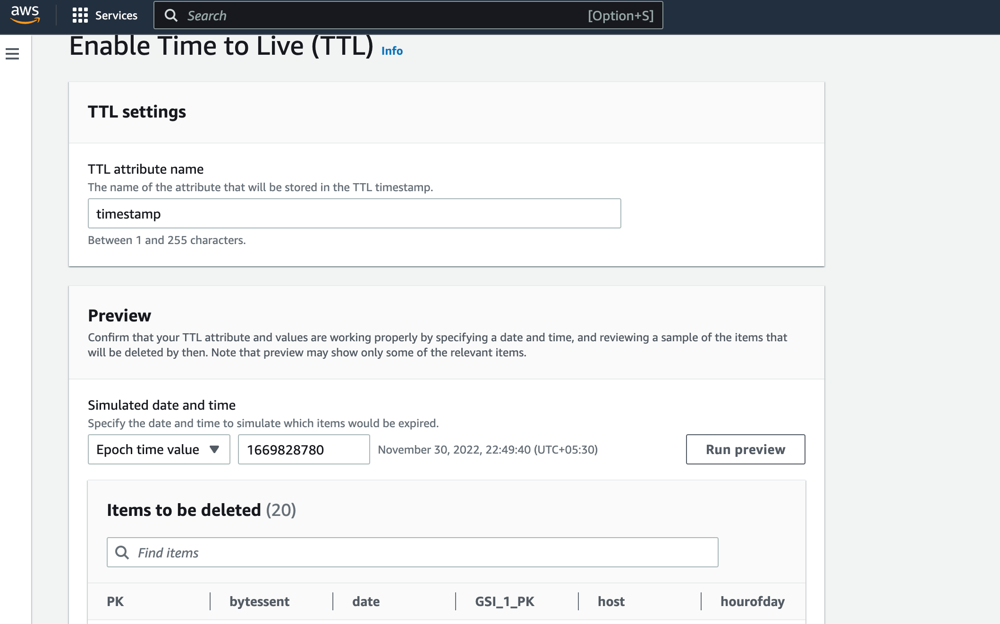

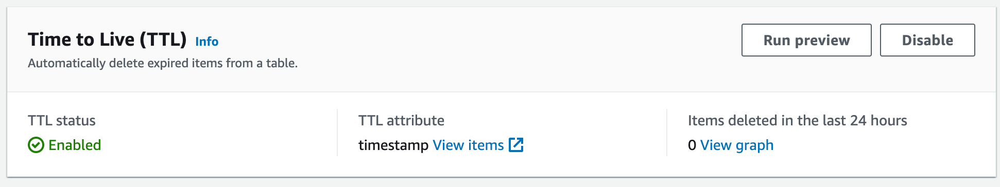

Now just wait.

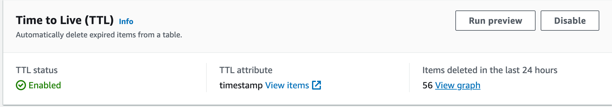

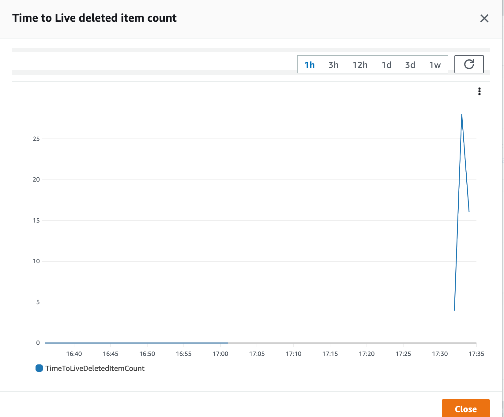

Now you can see data in the archive_table.

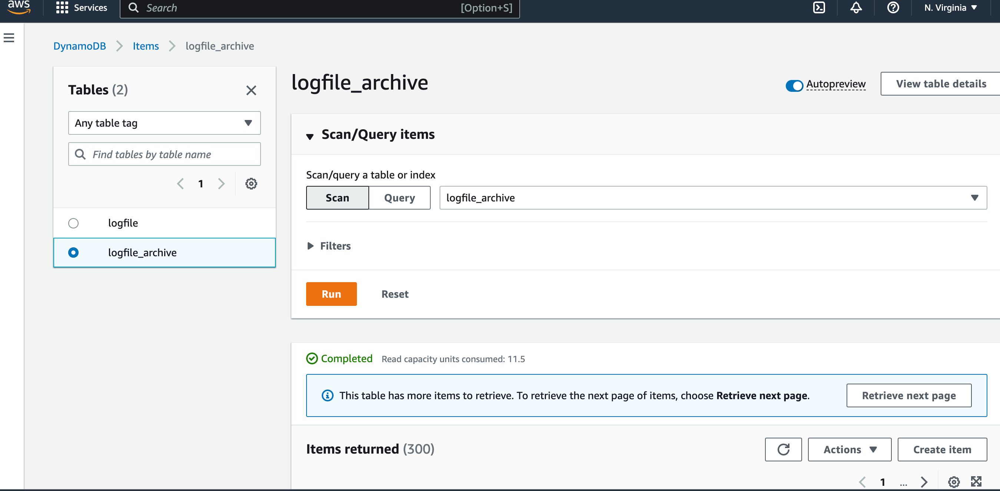

> https://docs.aws.amazon.com/amazondynamodb/latest/developerguide/time-to-live-ttl-how-to.html

> Happy Coding! :v: