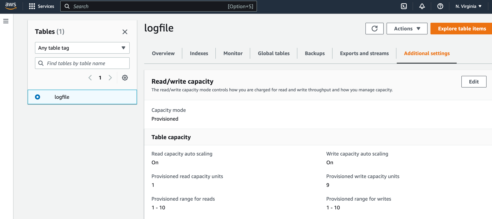

## Auto Scaling Kick in
Amazon DynamoDB global tables_ provide a fully managed solution for deploying a multi-Region, multi-active database, without having to build and maintain your own replication solution.
> Writing in `Asia Pacific (Mumbai) ap-south-1` region. Default RCUs is 1 & WCUs is 1. :point_down:

> As you can see throughput graph. Red color represents provisioned and blue color represents consumed & RCUs & WCUs both are 1 as you can see in graph.

We have already enabled auto scaling in [cross region global table](https://github.com/varunajmera0/AWS/tree/main/DynamoDB/CrossRegionGlobalTable) demo And I have attached the code also.

After sometime, capacity will increase automatically.
Now you can see increase cap in `Asia Pacific (Mumbai) ap-south-1` region.  :point_down:

> First, It provision 6 WCUs then after sometime,

> It provision 9 WCUs. Depend on how much data we write, it will adjust capacity b/w 1 to 10 because min capacity is 1 and max capacity is 10.

> Auto Scaling Activity in `Asia Pacific (Mumbai) ap-south-1` region

You can see increase cap in `US East (N. Virginia) us-east-1` region.  :point_down:

> Now, Interesting part -  If you remember we have enabled auto scaling for Read & Write capacity in [cross region global table](https://github.com/varunajmera0/AWS/tree/main/DynamoDB/CrossRegionGlobalTable) demo. Just look it this :point_down:.

In previous screenshot read cap is 1 but when data was coming continously in `US East (N. Virginia) us-east-1` region it increased read cap because we are writing in `Asia Pacific (Mumbai) ap-south-1`. AWS Replica will read first from `Asia Pacific (Mumbai) ap-south-1` and then write in `US East (N. Virginia) us-east-1` region automatically in background for you because we have already linked/replicated these tables in [cross region global table](https://github.com/varunajmera0/AWS/tree/main/DynamoDB/CrossRegionGlobalTable) demo and now both are connected.

> Auto Scaling Activity in `US East (N. Virginia) us-east-1` region

> CloudWatch

> Happy Coding! :v: