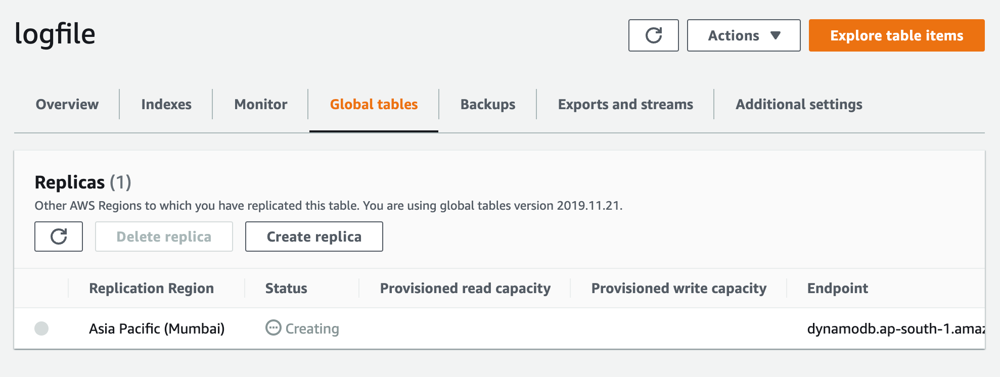

## Cross Region Global Table
Amazon DynamoDB global tables_ provide a fully managed solution for deploying a multi-Region, multi-active database, without having to build and maintain your own replication solution.

> As you can see that region is `US East (N. Virginia)
us-east-1` and only `1 table`. :point_up:

> As you can see I want to create existing table as globally. So for that you need to enable `auto scaling` or `on-demand` for `table capacity` and `index capacity`. So I have enabled the `auto scaling`. We need to enable `DynamoDB Streams` but now dyanomDB will be enabled automatically for new and old images, in case if you don't enable `DynamoDB Streams`.

Before create the replica in other region let's see how many tables are exist?

> As you can see there is only 2 tables in `Asia Pacific (Mumbai) ap-south-1` region.

* Go to global tables and click on create replica.
* Select appropriate option and click on create replica.

> `Asia Pacific (Mumbai) ap-south-1` region :point_down:

As you can see data is copied in `Asia Pacific (Mumbai) ap-south-1` region. :point_down:

So everything will be same. Now whenever you change/add in a table, It will reflect same in table of another region.

> Try to write from `#Asia Pacific (Mumbai) ap-south-1` region and read from `#US East (N. Virginia) us-east-1`. You can check your dynamodb UI.

> Happy Coding! :v: