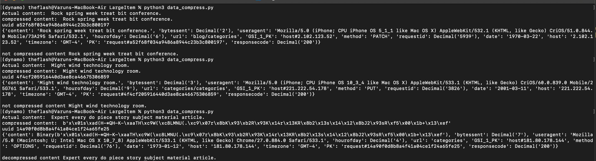

## Large Items in DynamoDB
Amazon DynamoDB currently limits the size of each item that you store in a table. The maximum item size in DynamoDB is 400 KB, which includes both attribute name binary length (UTF-8 length) and attribute value lengths (again binary length). The attribute name counts towards the size limit.

If your application needs to store more data in an item than the DynamoDB size limit permits, Either you can try to ompressing one/more large attributes or breaking the item into multiple items OR you can store in S3.

```
I have used compression technique. I have used zlib library to compress and decompress the data. 
In this example I assumed that if content size  is more than 50 chars I will compress it 
otherwise we will keep it as it is.
```



> https://docs.aws.amazon.com/amazondynamodb/latest/developerguide/bp-use-s3-too.html

> Happy Coding! :v:
